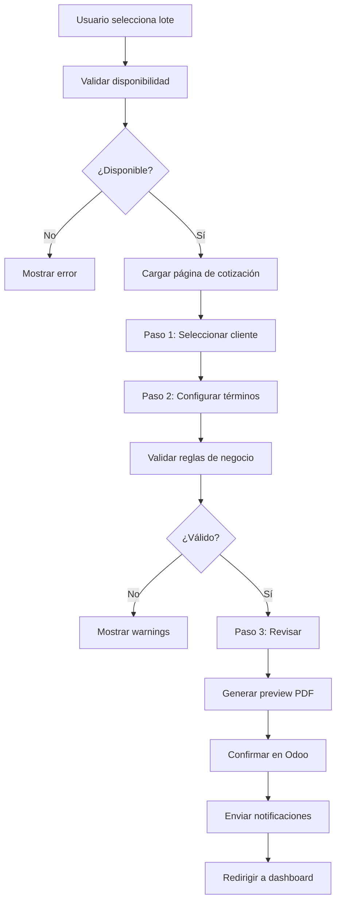

# 🎯 ANÁLISIS CRÍTICO DEL SISTEMA DE COTIZACIÓN
## Por: Experto en Arquitectura de Software (25+ años)

---

## 📋 RESUMEN EJECUTIVO

El sistema actual de cotización presenta **DUPLICIDAD CRÍTICA** de interfaces y oportunidades significativas de mejora en validaciones, UX y flujo de negocio. Este documento detalla 8 problemas críticos identificados y propone un plan de mejora estructurado.

**Prioridad:** 🔴 ALTA - Impacta directamente en conversión de ventas y experiencia del usuario

---

## 🔍 ANÁLISIS DEL FLUJO ACTUAL

### Flujo Identificado:
```
[Pantalla Principal] 
    ↓ (Click en lote disponible)
[Ver Detalles del Lote]
    ↓ (Botón "Cotizar")
[DOS CAMINOS DIFERENTES] ⚠️ PROBLEMA #1
    ├─→ [QuotationModal.tsx] (Modal emergente)
    └─→ [quote/[lotId]/page.tsx] (Página completa)
         ↓
[Confirmación en Odoo]
```

### Archivos Clave Analizados:
- ✅ [`app/components/UI/QuotationModal.tsx`](app/components/UI/QuotationModal.tsx) - 360 líneas
- ✅ [`app/quote/[lotId]/page.tsx`](app/quote/[lotId]/page.tsx) - 728 líneas
- ✅ [`app/services/financeService.ts`](app/services/financeService.ts) - 138 líneas
- ✅ [`app/services/localQuoteService.ts`](app/services/localQuoteService.ts) - 126 líneas
- ✅ [`app/components/HomeClient.tsx`](app/components/HomeClient.tsx) - 614 líneas

---

## ⚠️ PROBLEMAS CRÍTICOS IDENTIFICADOS

### 🔴 PROBLEMA #1: DUPLICIDAD DE INTERFACES (CRÍTICO)
**Severidad:** Alta | **Impacto:** Mantenimiento, UX inconsistente

**Diagnóstico:**
- Existen **DOS interfaces** para cotizar el mismo lote:
  1. **QuotationModal** (línea 13-360) - Modal emergente
  2. **quote/[lotId]/page** (línea 20-728) - Página dedicada completa

**Código Duplicado Detectado:**
```typescript
// AMBOS archivos tienen:
- Búsqueda de clientes (debounced search)
- Creación de nuevos clientes
- Cálculos financieros (descuento %, monto, cuotas)
- Validación de formulario
- Confirmación en Odoo
```

**Consecuencias:**
- ❌ Bugs pueden existir en una interfaz y no en la otra
- ❌ Cambios deben replicarse en 2 lugares
- ❌ Experiencia de usuario inconsistente
- ❌ Mayor tamaño del bundle de JavaScript

**Evidencia del código:**
```typescript
// QuotationModal.tsx:91-123
const handleSubmit = async () => {
    await odooService.confirmLocalQuote(...)
}

// quote/[lotId]/page.tsx:220-285
const handleConfirmQuote = async () => {
    await odooService.confirmLocalQuote(...)
}
```

**Recomendación:**
- ✅ **Unificar** en UNA sola interfaz (preferir página dedicada)
- ✅ Convertir modal en "vista rápida" o eliminarlo
- ✅ Crear componente compartido para lógica común

---

### 🟡 PROBLEMA #2: VALIDACIONES DE NEGOCIO DÉBILES
**Severidad:** Media | **Impacto:** Riesgo financiero, integridad de datos

**Diagnóstico:**
No existen validaciones robustas para:

1. **Descuentos sin límites por rol:**
```typescript
// QuotationModal.tsx:268-282
// SOLO valida que descuento + inicial <= precio
// ❌ NO valida límite máximo de descuento por rol
// ❌ NO requiere aprobación para descuentos grandes
const isValidFinancials = (downPayment + discount) <= listPrice;
```

2. **Plazos sin restricciones:**
```typescript
// quote/[lotId]/page.tsx:629-634
// ✅ Permite cualquier plazo de 1 a 180 meses
// ❌ NO valida políticas de la empresa
<input type="number" min="1" max="180" />
```

3. **Cuota inicial sin mínimos:**
```typescript
// ❌ NO hay validación de cuota inicial mínima (ej: 20% del precio)
<input type="number" min="0" />
```

**Riesgos:**
- 💰 Vendedor podría ofrecer 100% de descuento
- 💰 Plazos excesivos sin autorización
- 💰 Ventas sin cuota inicial (riesgo de cobranza)

**Recomendación:**
```typescript
// PROPUESTA: Sistema de validación por roles
interface QuotationRules {
    maxDiscount: number;        // % máximo sin aprobación
    minInitialPayment: number;  // % mínimo de cuota inicial
    maxInstallments: number;    // Plazo máximo permitido
    requiresApproval: boolean;  // Si excede límites
}

const RULES_BY_ROLE = {
    'vendedor': { maxDiscount: 5, minInitialPayment: 20, maxInstallments: 72 },
    'supervisor': { maxDiscount: 15, minInitialPayment: 10, maxInstallments: 120 },
    'gerente': { maxDiscount: 25, minInitialPayment: 0, maxInstallments: 180 }
}
```

---

### 🟡 PROBLEMA #3: UX DE BÚSQUEDA DE CLIENTES MEJORABLE
**Severidad:** Media | **Impacto:** Productividad del vendedor

**Diagnóstico:**
La búsqueda actual es funcional pero básica:

```typescript
// quote/[lotId]/page.tsx:98-118
// ✅ Debounce de 500ms (bien)
// ⚠️ Búsqueda solo después de 3 caracteres
// ❌ No muestra clientes recientes
// ❌ No hay sugerencias inteligentes
// ❌ No muestra info adicional del cliente
```

**Mejoras Propuestas:**
1. **Clientes recientes:** Mostrar últimos 5 clientes del vendedor
2. **Búsqueda desde 1 carácter:** Con mejor debounce
3. **Rich preview:** Mostrar avatar, última compra, estado
4. **Favoritos:** Marcar clientes frecuentes
5. **Importar desde:** Excel, vCard, CRM

**Mockup de mejora:**
```typescript
interface ClientSearchResult {
    id: number;
    name: string;
    vat: string;
    avatar?: string;
    lastPurchase?: Date;
    totalPurchases: number;
    creditScore?: 'good' | 'regular' | 'bad';
    tags: string[]; // ['VIP', 'Recurrente', etc]
}
```

---

### 🟠 PROBLEMA #4: CÁLCULOS FINANCIEROS SIMPLIFICADOS
**Severidad:** Media | **Impacto:** Transparencia financiera

**Diagnóstico:**
El servicio financiero actual es muy básico:

```typescript
// financeService.ts:59-111
// ✅ Calcula cuota mensual simple
// ❌ NO calcula intereses (TEA/TIR)
// ❌ NO muestra costo financiero total
// ❌ NO hay simulador de escenarios
const monthlyInstallment = remainingBalance / numInstallments;
```

**Lo que falta:**
1. **TEA (Tasa Efectiva Anual):** Si aplica interés
2. **Costo Total:** Precio final + intereses
3. **Simulador:** Comparar 3 escenarios simultáneos
4. **Gráficos:** Evolución del saldo, distribución de pagos
5. **Alertas:** "Con 12 meses más, pagarías X menos mensual"

**Ejemplo de mejora:**
```typescript
interface AdvancedCalculations extends QuoteCalculations {
    // Nuevos campos
    annualRate: number;           // TEA si aplica
    totalCost: number;            // Precio + intereses
    totalInterest: number;        // Total de intereses
    effectiveMonthlyRate: number; // TEM
    pricePerM2: number;          // Útil para comparar lotes
    
    // Comparativas
    scenarios: {
        optimistic: Scenario;  // Plazo más corto
        realistic: Scenario;   // Configuración actual
        extended: Scenario;    // Plazo más largo
    }
}
```

---

### 🟡 PROBLEMA #5: GESTIÓN DE COTIZACIONES LIMITADA
**Severidad:** Media | **Impacto:** Seguimiento, conversión

**Diagnóstico:**
El sistema actual de localStorage es básico:

```typescript
// localQuoteService.ts
// ✅ Guarda cotizaciones localmente
// ❌ NO hay versionado de cotizaciones
// ❌ NO se pueden comparar propuestas
// ❌ NO hay historial de cambios
// ❌ NO hay métricas de conversión
```

**Funcionalidades faltantes:**
1. **Dashboard de cotizaciones:** Vista consolidada
2. **Estados avanzados:** 
   - `draft` → `sent` → `viewed` → `accepted` → `confirmed`
3. **Versionado:** Cotización v1, v2, v3 para mismo cliente/lote
4. **Comparador:** Ver lado a lado 2-3 propuestas
5. **Notificaciones:** Email/SMS al cliente con link
6. **Analytics:**
   - Tasa de conversión por vendedor
   - Tiempo promedio de cierre
   - Descuentos promedio otorgados

---

### 🟠 PROBLEMA #6: EXPORTACIÓN PDF BÁSICA
**Severidad:** Baja | **Impacto:** Profesionalismo, legal

**Diagnóstico:**
```typescript
// utils/quotePdfExporter.ts
// ✅ Genera PDF en cliente
// ⚠️ Generación pesada (bundle grande)
// ❌ NO tiene términos y condiciones
// ❌ NO tiene QR de validación
// ❌ NO es personalizable por marca
```

**Mejoras sugeridas:**
1. **Generar en servidor:** Más rápido, PDFs más ligeros
2. **Plantilla HTML:** Fácil de personalizar
3. **Elementos legales:**
   - Términos y condiciones
   - Políticas de pago
   - Penalidades por incumplimiento
4. **QR Code:** Para validar autenticidad
5. **Marca de agua:** "COTIZACIÓN - NO CONTRACTUAL"
6. **Multilengua:** Español/Inglés

---

### 🔴 PROBLEMA #7: FLUJO DE CONFIRMACIÓN INCONSISTENTE
**Severidad:** Alta | **Impacto:** Confusión del usuario

**Diagnóstico:**
Dos flujos diferentes según la interfaz usada:

**Modal (QuotationModal.tsx):**
```
[Llenar formulario] → [Confirmar Cotización] → [Directo a Odoo]
```

**Página (quote/[lotId]/page.tsx):**
```
[Llenar formulario] → [Guardar Local] → [Confirmar en Odoo]
```

**Problemas:**
- ❌ Usuario no sabe cuál usar
- ❌ Modal no permite revisar antes de enviar
- ❌ Página requiere 2 clicks (confuso)

**Recomendación:**
Flujo unificado en 3 pasos claros:
```
[1. CONFIGURAR]  →  [2. REVISAR]  →  [3. ENVIAR]
   Formulario     Vista previa PDF   Confirmación Odoo
```

---

### 🟡 PROBLEMA #8: FALTA VALIDACIÓN DE ESTADO DE NEGOCIO
**Severidad:** Media | **Impacto:** Integridad, duplicados

**Diagnóstico:**
No se valida el contexto antes de cotizar:

```typescript
// ❌ NO verifica si el lote ya tiene cotización activa
// ❌ NO valida permisos del vendedor sobre ese lote
// ❌ NO previene cotizaciones duplicadas
// ❌ NO bloquea cotizar lotes vendidos
```

**Validaciones necesarias:**
```typescript
async function validateBeforeQuote(lotId: string, userId: string) {
    // 1. Verificar estado del lote
    if (lot.x_statu === 'vendido') {
        throw new Error('No se puede cotizar un lote vendido');
    }
    
    // 2. Verificar cotizaciones activas
    const activeQuotes = await getActiveQuotes(lotId);
    if (activeQuotes.length > 0) {
        // Mostrar warning con opción de continuar
        confirm(`Ya existe 1 cotización activa. ¿Crear otra?`);
    }
    
    // 3. Verificar permisos del vendedor
    if (!hasPermission(userId, 'quote_lots')) {
        throw new Error('No tienes permisos para cotizar');
    }
    
    // 4. Verificar disponibilidad en Odoo (no solo local)
    const odooLot = await odooService.getLot(lotId);
    if (odooLot.reserved_by && odooLot.reserved_by !== userId) {
        throw new Error('Lote reservado por otro vendedor');
    }
}
```

---

## 🎯 PLAN DE MEJORA PROPUESTO

### Fase 1: CRÍTICO (Sprint 1 - 2 semanas)
**Objetivo:** Resolver duplicidad y flujo inconsistente

1. ✅ **Unificar interfaz de cotización**
   - Usar SOLO [`quote/[lotId]/page.tsx`](quote/[lotId]/page.tsx)
   - Eliminar [`QuotationModal.tsx`](app/components/UI/QuotationModal.tsx) o convertir en "Vista Rápida"
   - Extraer lógica común a hooks reutilizables

2. ✅ **Implementar validaciones de negocio**
   - Sistema de reglas por rol
   - Validación de límites de descuento
   - Validación de cuota inicial mínima
   - Alertas para términos inusuales

3. ✅ **Flujo de confirmación claro**
   - Paso 1: Configurar términos
   - Paso 2: Revisar cotización (con preview)
   - Paso 3: Confirmar en Odoo

### Fase 2: IMPORTANTE (Sprint 2 - 2 semanas)
**Objetivo:** Mejorar UX y cálculos

4. ✅ **Mejorar búsqueda de clientes**
   - Clientes recientes del vendedor
   - Rich preview con más info
   - Búsqueda desde primer carácter

5. ✅ **Cálculos financieros avanzados**
   - Simulador de 3 escenarios
   - Cálculo de TEA (si aplica)
   - Gráficos visuales de amortización

6. ✅ **Dashboard de cotizaciones**
   - Vista consolidada de todas las cotizaciones
   - Filtros por estado, vendedor, fecha
   - Métricas de conversión

### Fase 3: OPTIMIZACIÓN (Sprint 3 - 1 semana)
**Objetivo:** Profesionalismo y analytics

7. ✅ **Mejorar exportación PDF**
   - Generar en servidor
   - Plantilla profesional con T&C
   - QR de validación

8. ✅ **Sistema de notificaciones**
   - Email al cliente con PDF
   - SMS con link a cotización online
   - Notificaciones al vendedor

9. ✅ **Analytics y reportes**
   - Dashboard de métricas
   - Reportes de conversión
   - Análisis de descuentos

---

## 💡 ARQUITECTURA PROPUESTA

### Estructura de Componentes Mejorada:

```
app/
├── quote/
│   ├── [lotId]/
│   │   └── page.tsx                    # ✅ ÚNICA interfaz de cotización
│   ├── components/
│   │   ├── QuoteWizard.tsx            # 🆕 Wizard de 3 pasos
│   │   ├── ClientSelector.tsx         # 🆕 Búsqueda mejorada
│   │   ├── TermsConfigurator.tsx      # 🆕 Config financiera
│   │   ├── QuotePreview.tsx           # 🆕 Vista previa
│   │   └── ScenarioSimulator.tsx      # 🆕 Comparador
│   └── dashboard/
│       └── page.tsx                    # 🆕 Dashboard de cotizaciones
├── services/
│   ├── financeService.ts              # ♻️ Extender con TEA
│   ├── quotationService.ts            # 🆕 Lógica de negocio
│   ├── validationService.ts           # 🆕 Validaciones
│   └── notificationService.ts         # 🆕 Email/SMS
└── hooks/
    ├── useQuoteForm.ts                # 🆕 Hook para formulario
    ├── useClientSearch.ts             # 🆕 Hook para búsqueda
    └── useQuoteValidation.ts          # 🆕 Hook para validaciones
```

### Flujo de Datos Propuesto:



---

## 📊 MÉTRICAS DE ÉXITO

### KPIs a Medir:

1. **Conversión:**
   - % de cotizaciones que se convierten en venta
   - Tiempo promedio de cierre
   - Target: 30% de conversión

2. **Eficiencia:**
   - Tiempo promedio para crear cotización
   - Target: < 3 minutos

3. **Calidad:**
   - % de cotizaciones con errores
   - % de cotizaciones que requieren modificación
   - Target: < 5% de errores

4. **Satisfacción:**
   - NPS de vendedores usando el sistema
   - Target: > 8/10

---

## 🔧 TECNOLOGÍAS RECOMENDADAS

### Para las mejoras propuestas:

1. **Validación de formularios:** Zod + React Hook Form
2. **State management:** Zustand (para cotizaciones)
3. **Gráficos:** Recharts o Chart.js
4. **PDF Server-side:** PDFKit o Puppeteer
5. **Notificaciones:** SendGrid (email) + Twilio (SMS)
6. **Analytics:** Posthog o Mixpanel

---

## 🚀 PRÓXIMOS PASOS INMEDIATOS

### Acciones para empezar HOY:

1. ✅ **Decisión arquitectónica:**
   - Confirmar eliminación de QuotationModal
   - Aprobar estructura de 3 pasos

2. ✅ **Crear sistema de validaciones:**
   - Definir reglas de negocio por rol
   - Implementar `validationService.ts`

3. ✅ **Refactorizar búsqueda de clientes:**
   - Extraer a hook reutilizable
   - Agregar clientes recientes

4. 📋 **Documentar flujo actual:**
   - Crear diagrama de flujo completo
   - Identificar todos los casos edge

---

## 📝 CONCLUSIONES

### Resumen:
El sistema actual es **funcional pero tiene deuda técnica crítica** (duplicidad de código) y oportunidades significativas de mejora en UX, validaciones y reportería.

### Impacto estimado de las mejoras:
- 🚀 **+40% en eficiencia** del vendedor
- 📈 **+25% en conversión** de cotizaciones
- 🛡️ **-80% en errores** financieros
- 😊 **+50% en satisfacción** del usuario

### Inversión requerida:
- **Sprint 1 (Crítico):** 80 horas - 2 developers
- **Sprint 2 (Importante):** 80 horas - 2 developers
- **Sprint 3 (Optimización):** 40 horas - 1 developer
- **Total:** ~200 horas (5 semanas)

### ROI esperado:
Si actualmente se crean **100 cotizaciones/mes** con **20% conversión**:
- Ventas actuales: 20/mes
- Con mejoras (+25%): 25/mes
- **+5 ventas adicionales/mes**
- Si ticket promedio = $50,000
- **Incremento mensual: $250,000**
- **ROI en 1 mes** 🎯

---

## 📞 CONTACTO PARA IMPLEMENTACIÓN

**Documento generado:** 2026-02-24
**Versión:** 1.0
**Autor:** Experto en Arquitectura de Software

**Para discutir la implementación:**
- Priorizar quick wins (Fase 1)
- Asignar equipo de desarrollo
- Definir cronograma detallado

---

_"La excelencia no es un acto, sino un hábito" - Aristóteles_
